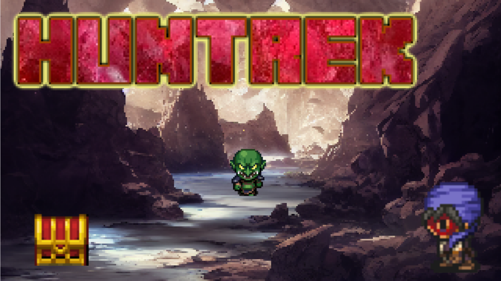

# Huntrek

## About the Game
A stealth-oriented RPG where you explore procedural maps, ambush enemies, and collect random loot to power up your party.

## Current Status
This project is still in early development. Expect rapid changes and experiments.

## Related Links
- Play the prototype on [itch.io](https://munokura.itch.io/huntrek)
- Devlog and screenshots are available on the itch.io page.

---

## 🎮 Features

- 🧭 Top-down real-time movement and combat
- 💥 Fast-paced encounters with randomized enemy positions
- 📦 Guaranteed item drops — including rare loot!
- 🧠 Optional puzzle-like enemy patterns on deeper floors
- 🔁 Endless replayability through procedural elements

---

## 🚧 Development Status

This project is under development.  
You can follow the progress on:

- [X (Twitter)](https://x.com/MunokuraDev)
- [Reddit](https://reddit.com/u/MunokuraGames)
- [itch.io](https://munokura.itch.io)

---

## 🔗 Related Resources

- [Munokura’s GitHub Profile](https://github.com/munokura)
- RPG Maker plugin repositories  
- Localization tools and experiments

---

## 📄 Copyright and Quotation Policy

© 2025 Munokura. All rights reserved.

You are welcome to quote or reference the contents of this repository for educational or informational purposes, as long as you clearly attribute the source **with a visible URL link to the original repository** (e.g., https://github.com/munokura/Huntrek).

> **Reposting large portions of the text, images, or other materials without permission is not allowed.**

This repository is intended for documentation and promotional purposes only.  
All content remains under copyright and may not be reused for commercial purposes without explicit permission.

---

Thank you for your interest in *Huntrek*!  
