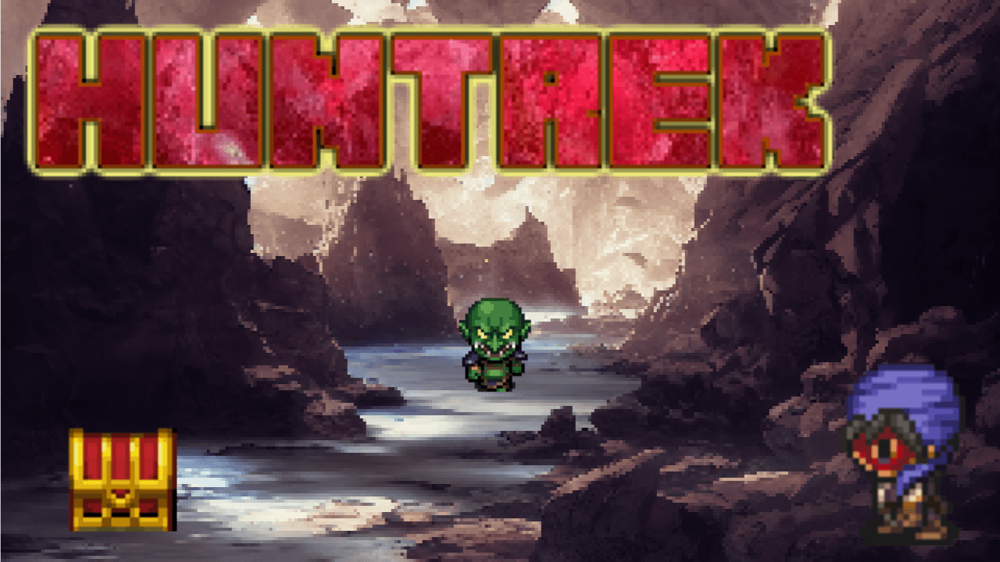

# Lootrek

**Lootrek** is a casual, loot-driven dungeon RPG made with RPG Maker MZ.  
Simple mechanics, random drops, and light tactical decisions make it ideal for short sessions.

> 🎯 *Jump in, grab gear, dive deeper.*

## 🎮 Features
- Top-down dungeon crawling
- Randomized loot from every enemy
- Easy-to-play loop with short runs
- Simple UI, fast gameplay, minimal story
- Made for PC, coming to Steam

## 📷 Screenshots
  
More in `/screenshots`

## 🔧 Tech & Tools
- Engine: RPG Maker MZ
- Custom plugins: [View my plugin repo](https://github.com/munokura)

## 🛠 Development Logs
Coming soon. Progress will be posted here and on:
- [Twitter/X @MunokuraDev](https://twitter.com/MunokuraDev)
- [itch.io](https://munokura.itch.io)
