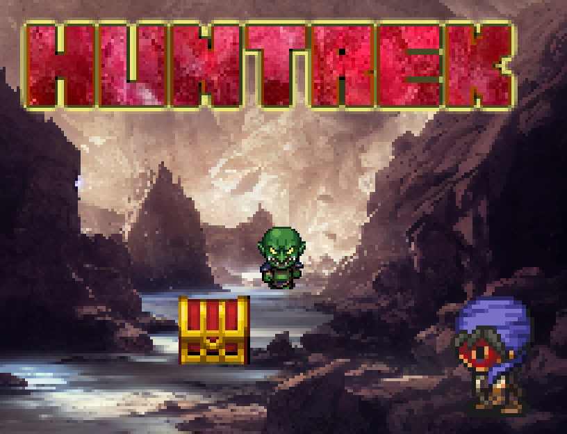

# Lootrek

**Lootrek** is a casual, loot-focused mini RPG currently in development with RPG Maker MZ.  
Explore a randomized dungeon, defeat enemies, and collect powerful items in a bite-sized adventure.  
Designed for players who enjoy light hack-and-slash gameplay and surprise item drops.

---

## 🎮 Features

- 🧭 Top-down real-time movement and combat
- 💥 Fast-paced encounters with randomized enemy positions
- 📦 Guaranteed item drops — including rare loot!
- 🧠 Optional puzzle-like enemy patterns on deeper floors
- 🔁 Endless replayability through procedural elements

---

## 🚧 Development Status

This project is under development.  
You can follow the progress on:

- [X (Twitter)](https://x.com/MunokuraDev)
- [Reddit](https://reddit.com/u/MunokuraGames)
- [itch.io](https://munokura.itch.io)

---

## 🔗 Related Resources

- [Munokura’s GitHub Profile](https://github.com/munokura)
- RPG Maker plugin repositories  
- Localization tools and experiments

---

## 📄 Copyright and Quotation Policy

© 2025 Munokura. All rights reserved.

You are welcome to quote or reference the contents of this repository for educational or informational purposes, as long as you clearly attribute the source **with a visible URL link to the original repository** (e.g., https://github.com/munokura/Lootrek).

> **Reposting large portions of the text, images, or other materials without permission is not allowed.**

This repository is intended for documentation and promotional purposes only.  
All content remains under copyright and may not be reused for commercial purposes without explicit permission.

---

Thank you for your interest in *Lootrek*!  
